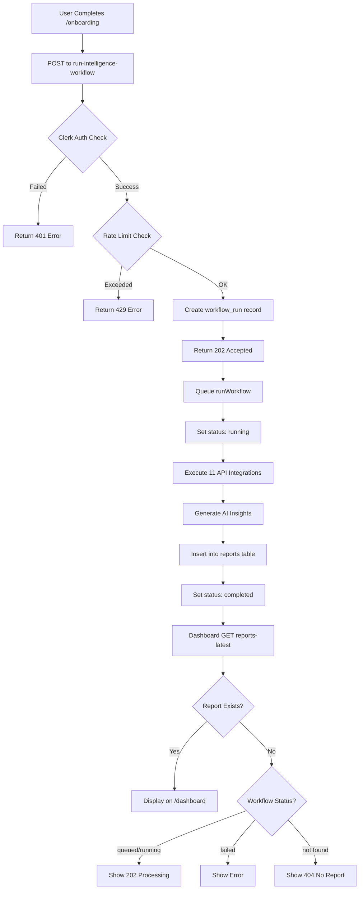

# Intelligence Workflow Debugging Guide

## Overview

The system has two main edge functions:
1. **`run-intelligence-workflow`** - Triggers report generation after onboarding
2. **`reports-latest`** - Fetches the most recent report for display on `/dashboard`

## APIs Used in `run-intelligence-workflow`

The workflow calls **12 different integration APIs** in sequence:

### 1. **DataForSEO APIs** (Primary Data Source)
Located in: `lib/integrations/dataforseo.ts`

- ✅ **identifyCompetitors()** - SERP analysis to find competitors
- ✅ **fetchEnhancedSerpResults()** - Enhanced SERP data with competitor positions
- ✅ **analyzeCompetitorKeywords()** - Keyword gap analysis
- ✅ **fetchCompetitorBacklinks()** - Competitor backlink profiles
- ✅ **fetchKeywordMetrics()** - Keyword volume, CPC, difficulty
- ✅ **buildSerpShareTimeline()** - Historical SERP visibility
- ✅ **buildCompetitorInsights()** - Competitive intelligence summary

### 2. **Content Analysis API**
Located in: `lib/integrations/content-analysis.ts`

- ✅ **fetchContentAnalysis()** - Content sentiment and quality analysis

### 3. **Firecrawl API**
Located in: `lib/integrations/firecrawl.ts`

- ✅ **fetchFirecrawlInsights()** - Deep website crawling and content extraction

### 4. **Domain Analytics API**
Located in: `lib/integrations/domain-analytics.ts`

- ✅ **fetchDomainAnalytics()** - Domain authority, traffic estimates

### 5. **Backlinks API**
Located in: `lib/integrations/backlinks.ts`

- ✅ **fetchBacklinkMetrics()** - Backlink profile analysis

### 6. **On-Page SEO API**
Located in: `lib/integrations/onpage.ts`

- ✅ **fetchOnPageAudit()** - Technical SEO audit

### 7. **PageSpeed Insights API**
Located in: `lib/integrations/pagespeed.ts`

- ✅ **fetchPageSpeedMetrics()** - Core Web Vitals
- ✅ **buildCoreWebVitals()** - Desktop/Mobile performance metrics

### 8. **Business Data API**
Located in: `lib/integrations/business-data.ts`

- ✅ **fetchBusinessData()** - Company firmographics

### 9. **Custom Search API (Google)**
Located in: `lib/integrations/search.ts`

- ✅ **fetchCustomSearchNews()** - Recent news and mentions

### 10. **VoilaNorbert API**
Located in: `lib/integrations/voilanorbert.ts`

- ✅ **enrichContacts()** - Contact/email enrichment

### 11. **LLM API (OpenAI/Anthropic)**
Located in: `lib/integrations/llm.ts`

- ✅ **generateInsights()** - AI-powered executive summary and recommendations

## Workflow Execution Flow



## Common Issues & Solutions

### Issue 1: Report Not Showing After Onboarding

**Symptoms:**
- User completes onboarding
- Dashboard shows "No report available" or stays in loading state

**Debugging Steps:**

1. **Check if workflow was triggered:**
```sql
SELECT id, status, triggered_at, completed_at, metadata
FROM workflow_runs
WHERE user_id = '<USER_ID>'
ORDER BY triggered_at DESC
LIMIT 5;
```

2. **Check if report was created:**
```sql
SELECT r.id, r.captured_at, wr.status
FROM reports r
JOIN workflow_runs wr ON r.workflow_id = wr.id
WHERE wr.user_id = '<USER_ID>'
ORDER BY r.captured_at DESC
LIMIT 1;
```

3. **Check for errors:**
```sql
SELECT id, status, metadata
FROM workflow_runs
WHERE user_id = '<USER_ID>' 
AND status = 'failed'
ORDER BY triggered_at DESC;
```

### Issue 2: Authentication Errors

**Symptoms:**
- 401 Unauthorized errors
- "Unable to authenticate" messages

**Check:**

1. **Clerk token is being sent:**
```javascript
// In Report.tsx, check headers:
const headers = {
  'Authorization': `Bearer ${clerkToken}` // ✅ Correct
};
```

2. **Supabase environment variables:**
```bash
# Check these are set in Supabase Dashboard > Settings > Edge Functions
CLERK_PUBLISHABLE_KEY=pk_test_xxx
CLERK_SECRET_KEY=sk_test_xxx
SUPABASE_URL=https://xxx.supabase.co
SERVICE_ROLE_KEY=eyJxxx
```

### Issue 3: Rate Limiting

**Symptoms:**
- 429 Too Many Requests
- "Daily report generation limit reached"

**Check daily limits:**
```sql
SELECT user_id, generation_count, last_reset
FROM daily_usage_limits
WHERE user_id = '<USER_ID>';
```

**Reset limits (if needed for testing):**
```sql
DELETE FROM daily_usage_limits
WHERE user_id = '<USER_ID>';
```

### Issue 4: Workflow Stuck in "queued" or "running"

**Symptoms:**
- Status never changes from "queued" or "running"
- Dashboard shows "processing" indefinitely

**Possible Causes:**
1. API timeout (one of the 11 APIs is hanging)
2. Deno edge function memory limit exceeded
3. Network issues

**Check logs:**
```bash
# View edge function logs
supabase functions logs run-intelligence-workflow --tail
```

**Manual completion (emergency):**
```sql
UPDATE workflow_runs
SET status = 'failed',
    metadata = jsonb_set(metadata, '{error}', '"Manual intervention - stuck"')
WHERE id = '<WORKFLOW_ID>';
```

## Database Schema

### Key Tables:

1. **`workflow_runs`**
   - `id` (uuid)
   - `user_id` (text)
   - `website_url` (text)
   - `status` (text): 'queued', 'running', 'completed', 'failed'
   - `triggered_at` (timestamp)
   - `completed_at` (timestamp)
   - `metadata` (jsonb)

2. **`reports`**
   - `id` (uuid)
   - `workflow_id` (uuid) → references workflow_runs
   - `payload` (jsonb) - The full report data
   - `captured_at` (timestamp)

3. **`onboarding_profiles`**
   - `user_id` (text)
   - `full_name` (text)
   - `website_url` (text)
   - `industry` (text)
   - `location` (text)

4. **`daily_usage_limits`**
   - `user_id` (text)
   - `generation_count` (integer)
   - `last_reset` (timestamp)

## Debugging Checklist

### Frontend (`/dashboard`)

- [ ] Check browser console for errors
- [ ] Verify Clerk token is present: `await getToken()`
- [ ] Check network tab for API calls to `reports-latest`
- [ ] Look for 401, 404, or 500 errors
- [ ] Verify correct Supabase URL in `.env`

### Backend (Edge Functions)

- [ ] Check `run-intelligence-workflow` logs for errors
- [ ] Verify all environment variables are set
- [ ] Check database for workflow_run record
- [ ] Check database for report record
- [ ] Verify Clerk authentication is working
- [ ] Check rate limits aren't exceeded

### Database

- [ ] Workflow record created with user_id
- [ ] Workflow status progressed from queued → running → completed
- [ ] Report record linked to workflow_id
- [ ] Report payload is valid JSON
- [ ] No orphaned workflow_runs (stuck in queued/running)

## Testing Commands

### Test Authentication:
```bash
curl -X GET https://YOUR_PROJECT.supabase.co/functions/v1/reports-latest \
  -H "Authorization: Bearer YOUR_CLERK_TOKEN"
```

### Test Workflow Trigger:
```bash
curl -X POST https://YOUR_PROJECT.supabase.co/functions/v1/run-intelligence-workflow \
  -H "Authorization: Bearer YOUR_CLERK_TOKEN" \
  -H "Content-Type: application/json" \
  -d '{
    "fullName": "Test User",
    "websiteUrl": "https://example.com",
    "industry": "Technology",
    "location": "San Francisco, CA"
  }'
```

### Check Workflow Status:
```sql
-- Get latest workflow for user
SELECT 
    w.id,
    w.status,
    w.triggered_at,
    w.completed_at,
    w.metadata,
    r.id as report_id,
    r.captured_at as report_created
FROM workflow_runs w
LEFT JOIN reports r ON r.workflow_id = w.id
WHERE w.user_id = '<USER_ID>'
ORDER BY w.triggered_at DESC
LIMIT 1;
```

## API Key Requirements

Make sure you have API keys configured for:

1. **DataForSEO** - Required (primary data source)
2. **Clerk** - Required (authentication)
3. **OpenAI/Anthropic** - Required (insights generation)
4. **Firecrawl** - Optional
5. **VoilaNorbert** - Optional
6. **Google Custom Search** - Optional
7. **PageSpeed Insights** - Optional (has free tier)

## Performance Notes

**Expected Execution Time:**
- Workflow typically takes: **3-10 minutes**
- Fastest: ~2 minutes (if all APIs respond quickly)
- Slowest: ~15 minutes (if APIs are slow or retrying)

**Timeout Considerations:**
- Supabase Edge Functions have a **120-second timeout** for HTTP responses
- That's why we return `202 Accepted` immediately
- The actual workflow runs in a `queueMicrotask()`

## Quick Fixes

### If Dashboard Shows Nothing:

1. **Check if onboarding was completed:**
```sql
SELECT * FROM onboarding_profiles WHERE user_id = '<USER_ID>';
```

2. **Manually trigger workflow (for testing):**
```bash
# Call the workflow endpoint directly
curl -X POST https://YOUR_PROJECT.supabase.co/functions/v1/run-intelligence-workflow \
  -H "Authorization: Bearer YOUR_TOKEN" \
  -H "Content-Type: application/json" \
  -d @onboarding-payload.json
```

3. **Check workflow logs:**
```bash
# Supabase CLI
supabase functions logs run-intelligence-workflow --limit 100
```

4. **Force refresh on frontend:**
- Clear localStorage
- Sign out and sign back in
- Hard refresh (Ctrl+Shift+R)

### If Workflow Failed:

1. **Check the error in metadata:**
```sql
SELECT metadata->>'error' as error_message
FROM workflow_runs
WHERE user_id = '<USER_ID>'
  AND status = 'failed'
ORDER BY triggered_at DESC
LIMIT 1;
```

2. **Common API failures:**
- DataForSEO API key invalid → Check `DATAFORSEO_LOGIN` and `DATAFORSEO_PASSWORD`
- LLM API failure → Check `OPENAI_API_KEY` or `ANTHROPIC_API_KEY`
- Rate limit on external API → Wait and retry

3. **Retry failed workflow:**
- User can go through onboarding again
- Or manually trigger via API call

## Success Indicators

✅ **Workflow Successful:**
```sql
SELECT 
    w.status = 'completed' as workflow_completed,
    r.id IS NOT NULL as report_created,
    r.payload->>'summary' IS NOT NULL as has_summary
FROM workflow_runs w
LEFT JOIN reports r ON r.workflow_id = w.id
WHERE w.user_id = '<USER_ID>'
ORDER BY w.triggered_at DESC
LIMIT 1;
```

✅ **Dashboard Should Display:**
- Executive Summary
- SERP charts
- Keyword opportunities
- Performance metrics
- Competitor analysis

## Still Having Issues?

1. **Enable debug mode:**
   - Add `console.log()` statements in Report.tsx
   - Check edge function logs in Supabase dashboard

2. **Verify environment variables:**
   ```bash
   # List all env vars (don't log the values!)
   supabase functions env list
   ```

3. **Test each API individually:**
   - Use the test functions in `supabase/functions/test-workflow/`
   - Run `test-dataforseo.ts`, `test-llm.ts`, etc.

4. **Check for Supabase issues:**
   - Visit Supabase status page
   - Check for planned maintenance
   - Review project quotas/limits

## Contact Points

If debugging doesn't resolve the issue, check:
- [ ] Supabase Dashboard → Edge Functions → Logs
- [ ] Clerk Dashboard → Users → Sessions
- [ ] Browser DevTools → Network → Failed requests
- [ ] Database → workflow_runs table → Latest record

---

**Last Updated:** 2025-10-01
